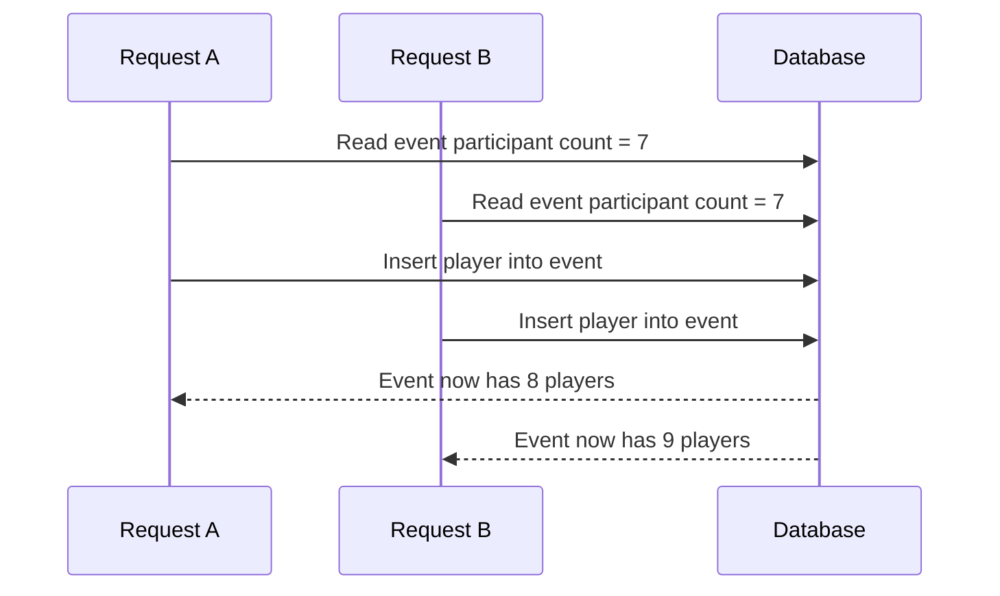
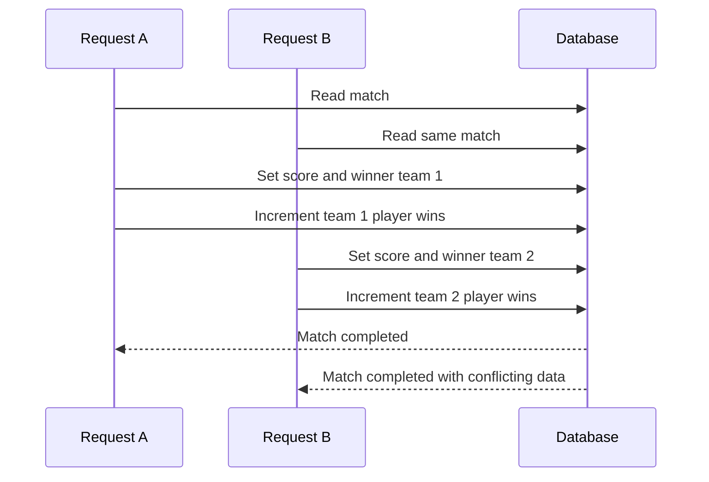
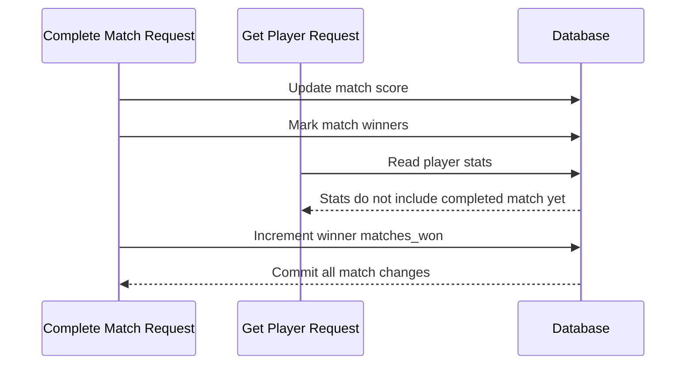

# Concurrency Control

This file lists 3 concurrency cases that could happen in Tennis Stats if the API had no concurrency control protection in place. 

## Case 1: Two users add players to the same event at the same time

Phenomenon: lost update 

Endpoint: `POST /events/{event_id}/players`

Problem: If an event has a participant limit of 8 and currently has 7 players, two requests could both read that theres one open spot. Without concurrency control, both requests could insert a player and the event could end with 9 players.

Solution: The endpoint starts a transaction and locks the event row with `SELECT ... FOR UPDATE` before checking the participant count and inserting the player

Why this is appropriate: The event capacity check and the insert need to happen together, locking the event row makes simultaneous add-player requests for the same event wait, so the second request sees the updated participant count before inserting.

## Case 2: Two users complete the same match at the same time

Phenomenon: lost update

Endpoint involved: `POST /matches/{match_id}/complete`

Problem: Two requests could try to complete the same match with different winning teams or different scores. Without concurrency control, the second request could overwrite the score and winner from the first request, while player statistics may already have been updated.

Solution: The complete-match endpoint starts a transaction and locks the match row with `SELECT ... FOR UPDATE` before updating the score, match winners, and player statistics.

Why this is appropriate: Completing a match changes multiple tables, so locking the match row makes only one completion request for that match run at a time, preventing conflicting winners and duplicate stat updates.

## Case 3: Player stats are read while a match is being completed

Phenomenon: non-repeatable read

Endpoints involved: `POST /matches/{match_id}/complete` and `GET /players/{player_id}`

Problem: Completing a match updates the match score, match participants, and player statistics. Without a transaction, another request might read player statistics after the match winner was changed but before the player's `matches_won` value was updated.

Solution: Match completion is wrapped in one database transaction using `db.engine.begin()`. The match score, match winners, and player stat updates commit together.

Why this is appropriate: A completed match should not be partially visible. The user should not see a match marked complete while the player statistics still show the old total.
